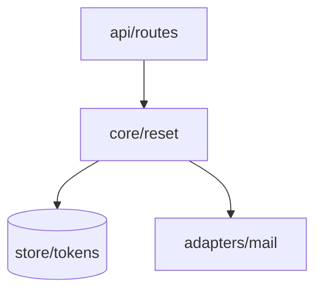

# The structure artifact — section contract

The shape of what `architecture-design` writes. Read this before writing one; `SKILL.md` carries the
method, this file carries the format.

**The artifact is a recap, not a decision.** Every row in it restates something already settled — during
`spec-grilling`, in a record under `docs/adr/`, in `prd.md`, or in `research.md` — and cites where. That is
what makes it signable in one sitting: a person at the gate is confirming that the decisions they already
took add up to a structure carrying the behaviour `acceptance.md` promises, not being asked to take new
ones. Where nothing was decided, the row says so and the question moves to §6. It is never resolved here.

**The six headings and their order are fixed.** The first five are Anthropic's `system-design` framework,
verbatim and in its order; the sixth is this suite's, because the two code-cold sweeps in
`references/lens-passes.md` need somewhere to land and a person needs their questions kept apart from the
answers. A person signing reads them in this order, and `spec-review` finds a section by name. Number them
as below.

The file also has a length budget, and it binds every section here: `SKILL.md` step 2 sets it at 2000 lines
and says what to cut when you are over. Read it before you write, not after — the sections below are all
tables and citations precisely so the budget is spent on rows rather than on prose.

One file carries the shape: a feature's `docs/features/<slug>/architecture.md`. It states what this
feature changes about the structure, self-contained against its own `research.md` — there is no
repository-level map to inherit from. A layer order, where one was decided, lives in `docs/adr/` and is
cited by §2.

## The header block

Open the file with a fenced block, before §1:

```
feature:  <slug>
status:   unsigned
reads:    acceptance.md · research.md · prd.md · environment.md · docs/adr/
```

`status:` is `unsigned` until a person flips it, and nothing an agent does flips it — the signature is
the whole point of the artifact.

## Two rules that bind every section below

**Recap, never decide.** Every table here has a provenance column — `Source`, `Decision`, or `ADR`. It
carries an id from §5, an `ADR-NNN` that resolves to a file under `docs/adr/`, a named artifact
(`prd.md`, `research.md`, `environment.md`), or `default — not contested` where `spec-grilling` stated the
answer as a batched default and the person let it stand. A default the person saw and did not object to is
real provenance, so that cell is complete. An **empty** cell is not: it means nobody has been asked, which
is what the column exists to surface, and it becomes a §6 row rather than a cell you fill in from judgement.

**Never pin what Plan owns.** No function signature, no field list, no schema, no wire format, no line
number. §3 is the section this rule is aimed at, because its five topics are exactly the ones that tempt
you: a row there names the *decision* — "cursor pagination, `ADR-014`" — and `api-design` writes the shape
into `plan.md` later. A row that pins a shape here settles during Spec what a person at the gate has no way
to check, and `plan-breakdown` then has two sources for one fact.

## The six sections

### `## 1. Requirements Gathering`

Three tables, in Anthropic's order: what it does, what it must hold to, what boxes it in. All three are
recap — `prd.md` and `acceptance.md` state the first, and the second and third are usually the ones nobody
wrote down, which is why they get a table here instead of a sentence.

**Functional requirements** — what it does.

| # | Requirement | Source |
|---|---|---|

One row per capability the feature owes, cited to `prd.md` or the record that added it. Product altitude:
what the system does for whom, never how. The per-scenario trace lives in §2's data flow, and duplicating
`acceptance.md`'s scenario list here gives the set-equality check in §2 a second thing to disagree with.

**Non-functional requirements** — scale, latency, availability, cost.

| Dimension | Target | Source |
|---|---|---|

**All four dimensions get a row, every time**, in that order. Where a target was stated, cite it. Where
none was, write `not stated` in `Target` and raise it as a §6 row — do not estimate one into the cell.
A latency target is a promise to a user and a cost ceiling is a promise to whoever pays; an agent inventing
either hands the person a number they never approved, dressed as a recap of something they did.

The four rows are fixed rather than filled-as-relevant because an omitted dimension and a dimension nobody
thought about look identical in a table of three rows, and the one nobody thought about is the one that
ends a launch.

**Constraints** — what boxes the design in.

| Constraint | Value | Source |
|---|---|---|

Team size, timeline, and the existing stack at minimum. The stack rows come from `research.md` and
`environment.md`; the first two come from the person, and `not stated` is an honest cell here too. These
belong in a design document because they are the reasons a reader will otherwise read as incompetence —
"why did they not just use a queue" is answered by a row saying there is one engineer and three weeks.

### `## 2. High-Level Design`

Four parts, in Anthropic's order: the component diagram, the data flow, the API contracts, the storage
choices.

**Component diagram.** Draw the graph before you tabulate it — this is a graph written as rows, and nobody
can see a graph in a table; they have to hold every row in their head and assemble it. Open with a Mermaid
`flowchart` whose nodes are the components in the table below and whose arrows are exactly its dependency
rows: one arrow per row, and no arrow that has no row.



Mermaid, specifically, because it is text. It splices into the page's source block without breaking the
byte comparison, it renders in GitHub and most editors with nothing installed, and it carries no asset the
repository would have to keep.

| Component | Responsibility — its one reason to change | New | Depends on |
|---|---|---|---|

One row per unit with a single reason to change. `New` is a column rather than a sentence because "which
parts of the system are new" is the first thing the person at the gate has to answer, and a column answers
it without reading. `Depends on` lists the components this one reaches, and every arrow in the diagram is
one of these entries.

Then the dependency detail, one row per edge:

| From | To | Why this edge exists | Decision |
|---|---|---|---|

`Decision` follows the provenance rule above. Where the repository has decided a layer order, state it
above this table, say which edges the order permits, put each layer in its own Mermaid `subgraph` in that
order so an edge crossing the wrong way shows as an arrow pointing back up, and cite the ADR per row.
Where it has not, see [Where no layer order is decided](#where-no-layer-order-is-decided) below.

Follow with two short lists, because a table of what exists cannot show either:

- **`Not components.`** — what a reader would expect to find in the table and why it is absent: an
  existing part this feature only calls, a discipline that emits into another artifact. A reader cannot
  derive an omission from a list.
- **`Edges a reader might expect and that do not exist:`** — each with its reason. "The rules never read
  the memory" is exactly the kind of constraint a later diff breaks by accident, and it is invisible in a
  table of present edges.

**Data flow.** One row per **scenario in `acceptance.md`, keyed by its id**.

| Scenario | Behaviour | Path |
|---|---|---|

`Path` names the components in the order they act, joined with `→`. This is the section that makes the
document checkable rather than merely plausible: a scenario with no path is a behaviour nothing was
designed to handle.

**Set equality is the check:** every scenario id appears exactly once here, and every row here names a
scenario. Not a read-through — take the ids out of both files and compare the sets. A read-through is what
misses the one in the middle.

`architecture-design` runs against a **draft** `acceptance.md` — present, not signed — and the two are
signed together in one act at the Spec gate, so the scenarios cannot move between the trace and the
signature. Simultaneity, not sequence, is what stops the moving target, and it does the better job: while
the file is still editable a finding can point either way, at a missing part of the structure or at a
scenario that should never have been written. Bound it at **one** hand-back to `acceptance-criteria`;
whatever survives is a §6 row.

**API contracts.** Who reaches this feature's surface, and what they may depend on.

| Consumer | Surface it reaches | What it may depend on | Decision |
|---|---|---|---|

Name a consumer **inside** the repository alongside the edge row that carries it, and a consumer
**outside** it — a web client, another service, anyone holding a token — with no edge row, because no edge
row can carry one. The outside ones are why this table exists: a consumer in the repository is already
visible in the diagram, and a consumer outside it is visible nowhere else in the artifact. `_none_` where
nothing reaches in.

`What it may depend on` names the commitment at the level a person can check — resource model, one error
envelope, pagination stance, versioning and compatibility stance — and cites the record. Never the field
list; that is `plan.md`'s. This is also where Hyrum's Law does its damage, since the surface commits to
whatever a consumer can observe whether or not this table says so.

**Storage choices.**

| Store | What it holds | Why this store | Decision |
|---|---|---|---|

`Why this store` gives the reason, not the choice restated: "one writer, so a queue buys nothing" is a
reason; "chose Postgres" is the `Store` cell said twice. A reader who cannot see why cannot tell a decision
from a default nobody examined.

### `## 3. Deep Dive`

Five topics, in Anthropic's order. Each is a table, and **each is a recap of what was already decided** —
the section that most tempts an agent into deciding, which is why the never-pin rule above is aimed here.

Every topic gets its block even when the feature has nothing of that kind. Write the heading and `_n/a —
<one clause saying why>_` underneath: "no cache; single-digit reads per minute". A topic that is absent
because it does not apply and one that is absent because nobody thought about it look identical otherwise,
and only the second is a problem.

| # | Decision | Why | Decision source |
|---|---|---|---|

Under each of:

- **Data model** — the entities and the relations between them, named. Not the columns, not the types.
- **API endpoint design** — the style (REST, GraphQL, gRPC) and the resources it exposes. Not the routes,
  not the payloads.
- **Caching strategy** — what is cached, where, and what invalidates it.
- **Queue / event design** — what is asynchronous, what ordering or delivery guarantee it rests on.
- **Error handling and retry logic** — what is retried, with what backoff, and what is not retried and why.
  The `and why not` half is the one that matters: a non-idempotent write that gets retried is a corruption
  bug, and this row is where somebody notices before it is code.

A topic with no record behind it is a **§6 row**, not a cell you decide. Left out, it gets settled during
Implement by whichever slice reaches it first, and the person never sees the choice.

### `## 4. Scale and Reliability`

Four parts, in Anthropic's order. **You may do the arithmetic; you may not pick the posture.** Estimating
is a calculation — the inputs are in §1 and the multiplication is checkable by anyone reading it. Choosing
to scale horizontally, add a replica, or accept an hour of downtime is a decision with a cost attached, and
it goes through `spec-grilling` into a record, or it becomes a §6 row.

**Load estimation.** Show the arithmetic; a bare conclusion is not checkable.

| Quantity | Estimate | How it was derived |
|---|---|---|

`How it was derived` carries the inputs and the multiplication, each input cited to its §1 row —
`50k users × 2 resets/yr ÷ 3.2e7 s ≈ 0.003 rps`. A reader has to be able to disagree with the input rather
than with the number, because the input is what will turn out to be wrong.

**Horizontal vs. vertical scaling.**

| What scales | Direction | Bound it hits first | Decision |
|---|---|---|---|

`Bound it hits first` is the useful column and it is an observation: connections, memory, a single writer,
a rate limit. `Direction` and the choice behind it are cited or `not decided`.

**Failover and redundancy.**

| Component | What happens when it fails | Recovery | Decision |
|---|---|---|---|

`What happens when it fails` is an observation of the system as designed, so write it even where nothing
was decided — including `request fails, no retry, user sees an error`. That row is the one a reader most
needs; deleting it to make the column look tidy removes the only warning there was.

**Monitoring and alerting.**

| Signal | What it would catch | Emitted today by | Alerts | Decision |
|---|---|---|---|---|

`Emitted today by` says **`nothing`** where nothing emits it, and the row stays. Naming a hypothetical
dashboard is what makes this section decorative; naming the gap is what makes it worth signing.
`observability-and-instrumentation` owns how a signal gets emitted — this table only records which ones the
design assumes exist.

### `## 5. Trade-off Analysis`

Anthropic's rule is the whole section: every decision has trade-offs, so make them explicit. This is the
citation index that §2, §3 and §4 point at with their `Decision` cells, and it is where the cost of each
choice is written down rather than implied.

| # | Chosen | Rejected | Cost paid | Why | ADR |
|---|---|---|---|---|---|

`Rejected` and `Why` are copied from the record. A record with nothing rejected is a §6 question, not
something to improve here — a choice with no alternative was not a choice.

`Cost paid` is the column Anthropic's framework is built around and the one an agent skips: name what got
worse, along whichever of complexity, cost, team familiarity, time to market, or maintainability this
decision spent. "Nothing" is not an available answer; if you cannot name the cost, the trade-off was not
analysed, and that is a §6 row.

`ADR` points at the record where the decision was hard to reverse, in the format `documentation-and-adrs`
owns. A choice the person approved that is too cheap to reverse for a record still gets a row with `ADR`
empty — it was chosen, and nothing else records that. For those rows `Why` is written here or nowhere, and
it gives the **reason**, never the choice restated.

**What we would revisit as the system grows.** Anthropic's framework closes on this, and it is the part a
design document is uniquely able to carry: the author knows which assumptions are load-bearing, and six
months later nobody does.

| Trigger | What breaks | What we would change |
|---|---|---|

`Trigger` is an observable threshold, not a feeling — `> 50 rps`, `a second writer`, `a mobile client`,
`retention past 90 days`. Each one names an assumption in §1 or §4 that stops holding, so a later reader
can check whether it still does. A row saying "if it gets slow" is worth nothing to them.

### `## 6. Open Questions for the Human`

Numbered, under two headings:

```
### Left open by spec-grilling
### Raised by the depth and interface passes
```

Each states the question, then a **recommended** answer with one sentence of reasoning, and has to be
answerable at the gate without opening a skill. The groups stay separate because their provenance differs —
the first is what the dialogue could not settle, the second is what a code-cold sweep found afterwards in
what got written — and a person weighing a question needs to know which one they are reading.

**Open the section with the line naming who answers**, in these words:

> These are unanswered by design. The person answers them at the gate; no agent resolves one.

Every row carries a recommended answer, which makes it read exactly like something a later pass should
apply — `spec-review` runs after this one and its standing instruction on a contestable item is to apply
its best correction and flag it inline. That line is what stops it, and a question answered silently is the
failure this artifact exists to stop, one indirection removed.

**Only what `spec-grilling` could not settle belongs in the first group** — a question the dialogue left
open, a scenario that came back unresolved from §2's data flow, a `not stated` cell in §1, a §3 topic no
record answers, a `Cost paid` nobody can name. A question you could have cited a record for is not open,
and one you never put to the person is not open either.

**The second heading is written even when nothing came back**, with `_none_` under it. Two sweeps that
found nothing and two sweeps that never ran leave the same blank section otherwise, and those have
different fixes.

## Where no layer order is decided

Most repositories the suite installs into have never decided a layer order. §2's component diagram then
has one job: **record what the code does today, and say that nothing has been decided.**

- Write `layer order: not decided` above the edge table, in those words, so the phrase is greppable.
- Fill the edge table from `research.md` only. Every edge is one the survey found in the code as it stands,
  and `Why this edge exists` says where it was found rather than why it ought to.
- **Propose nothing.** No "should", no "target state", no `subgraph` tiers, no row ordering that implies
  one. Numbering components into tiers is deciding the order without saying so.
- If the feature cannot proceed without an answer, that is a §6 question for the person at the gate.

A reader has to be able to tell **what the code does** from **what a diff is permitted to do**. Where no
order is decided, the second is empty, and §2 says so rather than leaving the first to be read as both.

An architecture document that quietly invents a layering is worse than none, because the next feature
inherits an order nobody chose and nobody can point at who chose it.

### What a later feature does with those rows

When an `architecture.md` says `layer order: not decided`, its edge rows are **observations, not
permission.**

- A later feature's `architecture.md` records its own edges the same way, from its own `research.md`.
- It does not read the recorded set as the set it may add to, and it does not read an absent edge as
  forbidden. Neither reading is available from an observation.
- Deciding the order is its own decision: it goes through `spec-grilling` into a record under
  `docs/adr/`, and a person signs it.
- Until someone decides, every feature's §2 carries the same `layer order: not decided` line.

## The page

`docs/features/<slug>/architecture.html` is hand-authored, committed next to the markdown, and read by the
person at the gate. The markdown stays: a later feature's structure is a delta against this one, and a
delta needs a base something can diff.

**Self-contained, with no external requests.** Inline the CSS and any script, embed images as `data:` URIs,
use system font stacks. A colleague who clones the repository months later and opens the file with the
network off sees the same page; one remote font makes the artifact depend on a host nobody in the
repository controls.

**Theme-aware.** Define the light palette on bare `:root`, redefine the same tokens under
`@media (prefers-color-scheme: dark)` guarded as `:root:not([data-theme="light"])`, and again under
`:root[data-theme="dark"]`. Give `body` an explicit background token.

**It draws §2's component diagram, not just the table.** The embedded source block carries the Mermaid text
along with everything else, but text is not a picture and the page exists so a person can see the structure
at the gate. Draw the same graph as **inline SVG** — the same nodes and the same arrows §2's block has,
laid out so the layer order reads top to bottom where one was decided. Inline SVG because the page takes no
external requests and a Mermaid runtime would be one. `architecture.md` is the source of truth: where the
drawing and the block disagree, the drawing is what changes.

**It embeds `architecture.md` verbatim**, in a collapsed source block:

```html
<details>
  <summary>Source — <code>architecture.md</code>, embedded verbatim</summary>
  <div><pre id="src-out"></pre></div>
</details>

<script id="src-md" type="text/markdown">…the file's bytes…</script>
<script>
  document.getElementById('src-out').textContent =
    document.getElementById('src-md').textContent.replace(/^\n/, '');
</script>
```

**Splice the block from the file. Do not retype it.** Read `architecture.md` and place its bytes between
the tags: the opening tag is immediately followed by the file's first byte, and the closing tag
immediately follows its last. Do not reflow, do not re-wrap a long line, do not fix a typo on the way
through — correct the typo in `architecture.md` and splice again. Retyping is the whole reason the block
exists: two hand-authored copies of one fact drift, and one that was typed rather than spliced drifts on
its first character while looking exactly like one that was not.

One constraint the embedding puts on the markdown: `architecture.md` must not contain the literal string
`</script>`, which would end the block early and make the comparison below report drift that is not drift.
If a code fence needs it, split the token.

## The comparison check

The page cannot silently disagree with its source, and the way that is known is a **comparison, not an
inspection** — reading a page and its markdown side by side is how "38 skills" and "39 skills" both looked
right at the same byte count.

Compare the embedded block to the file byte for byte. Three outcomes, each with its own fix:

| Exit | Means | Fix |
|---|---|---|
| `0` | the block is byte-identical to the file | nothing |
| `1` | the block is present and drifted | re-splice from `architecture.md` |
| `2` | there is no block at all | the page is not conforming; add it |

```bash
python3 - docs/features/<slug>/architecture.md docs/features/<slug>/architecture.html <<'PY'
import pathlib, re, sys
md = pathlib.Path(sys.argv[1]).read_text()
html = pathlib.Path(sys.argv[2]).read_text()
m = re.search(r'<script id="src-md" type="text/markdown">(.*?)</script>', html, re.S)
if not m:
    print("FAIL: no embedded source block"); sys.exit(2)
if m.group(1) != md:
    print(f"FAIL: drift — embedded {len(m.group(1))} B vs file {len(md)} B"); sys.exit(1)
print("PASS: embedded block byte-identical"); sys.exit(0)
PY
```

Run it against a deliberately drifted copy once before you trust it. A check you have only ever watched
pass is not known to work, and this repository has shipped one that passed over the exact condition it
existed to prevent.
