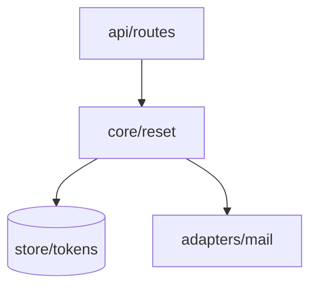

# The structure artifact — section contract

The shape of what `architecture-design` writes. Read this before writing one; `SKILL.md` carries the
method, this file carries the format.

`architecture-design` reconciles, grades, and renders: it traces every
`acceptance.md` scenario through the structure, records the invariants, has what it wrote graded code-cold,
and cites the decisions taken during `spec-grilling` rather than taking them itself. That is why §2, §3 and
§4 are inventories, §6 is an index of citations, and §8 is where the grading lands.

**The eight headings and their order are fixed.** A person signing reads them in this order, and
`spec-review` finds a section by name. Number them as below.

The file also has a length budget, and it binds every section here: `SKILL.md` step 2 sets it at 2000 lines
and says what to cut when you are over. Read it before you write, not after — the sections below are all
tables and citations precisely so the budget is spent on rows rather than on prose.

One file carries the shape: a feature's `docs/features/<slug>/architecture.md`. It states what this
feature changes about the structure, self-contained against its own `research.md` — there is no
repository-level map to inherit from. A layer order, where one was decided, lives in `docs/adr/` and is
cited by §3.

## The header block

Open the file with a fenced block, before §1:

```
feature:  <slug>
status:   unsigned
reads:    acceptance.md · research.md · prd.md · docs/adr/
```

`status:` is `unsigned` until a person flips it, and nothing an agent does flips it — the signature is
the whole point of the artifact.

## The eight sections

### `## 1. Scope`

Prose. What this feature changes about the structure, what it removes, and what it leaves alone. Name the
structural question the feature answers — everything below is placed by that answer rather than by topic,
and a reader who cannot see the question cannot tell whether a module is in the right place.

State plainly when the feature changes no structure. A short §1 that says so is a signable answer; an
inflated one is not.

### `## 2. Modules`

| Module | Responsibility — its one reason to change | Layer | New |
|---|---|---|---|

One row per unit with a single reason to change. `Layer` is the tier from §3, or `—` where the repository
has decided no order. `New` is a column rather than a sentence because "which parts of the system are
new" is the first thing the person at the gate has to answer, and a column answers it without reading.

A module earns its row by the deletion test, which `codebase-design` owns and `spec-grilling` applied
with the person. Carry that test's answer in
`Responsibility` — what reappears across which callers — not its verdict, since a reader can disagree
with "deleting it puts retry and backoff into all four callers" and cannot with "it earns its keep".

Follow the table with a **`Not modules.`** paragraph naming what a reader would expect to find here and
why it is absent — an existing component this feature only calls, a discipline that emits into another
artifact. A reader cannot derive an omission from a list.

### `## 3. Layers and edges`

The dependency edges this feature adds between parts that already exist.

**Draw the graph before you tabulate it.** This section is a graph written as rows, and nobody can see a
graph in a table — they have to hold every row in their head and assemble it. Open the section with a
Mermaid `flowchart` whose nodes are §2's modules and whose arrows are exactly the rows below it: one arrow
per row, and no arrow that has no row.



Mermaid, specifically, because it is text. It splices into the page's source block without breaking the
byte comparison, it renders in GitHub and most editors with nothing installed, and it carries no asset the
repository would have to keep. Where the repository has decided a layer order, put each layer in its own
`subgraph` in that order, so an edge crossing them the wrong way shows up as an arrow pointing back up
rather than as a row somebody has to notice.

| From | To | Why this edge exists | Decision |
|---|---|---|---|

Every edge cites what it rests on: an id from §6, an `ADR-NNN` under `docs/adr/`, or `default — not
contested` where `spec-grilling` stated the answer as a batched default and the person let it stand. A
default the person saw and did not object to is real provenance, so that cell is complete. An **empty**
cell is not — it means the edge was never put in front of anyone, which is what this column exists to
surface.

Then **`Edges a reader might expect and that do not exist:`** — a short list, each with its reason. An
absent edge is invisible in a table of present ones, and "the rules never read the memory" is exactly the
kind of constraint a later diff breaks by accident.

Then **`Consumers of this feature's surface:`** — who reaches in, one per line, `_none_` where nothing
does. Name a consumer **inside** the repository with the row above that carries its edge, and a consumer
**outside** it — a web client, another service, anyone holding a token — with no row, because no edge row
can carry one. The outside ones are why this list exists: a consumer in the repository is already visible
in the table, and a consumer outside it is visible nowhere else in the artifact. That is also where Hyrum's
Law does its damage, since the surface commits to whatever they can observe whether or not §6 says so.

Where the repository has decided a layer order, state it above the table and say which edges the order
permits. Where it has not, see [Where no layer order is decided](#where-no-layer-order-is-decided) below.

### `## 4. Seams`

Where an implementation can be swapped without its callers knowing.

| Adapter | When | Who does the work |
|---|---|---|

**A seam with one adapter is indirection, not a seam.** Name the second adapter or drop the row — that is
the two-adapter rule, and `codebase-design` owns it.

Say which seams already existed and which this feature introduces. A seam usually exists because
something went wrong once; when it does, say what, because the next reader will otherwise remove it.

### `## 5. Data flow, per scenario`

| Scenario | Behaviour | Path |
|---|---|---|

One row per **scenario in `acceptance.md`, keyed by its id**. `Path` names the §2 modules in the order
they act, joined with `→`.

**Set equality is the check:** every scenario id appears exactly once here, and every row here names a
scenario. Not a read-through — take the ids out of both files and compare the sets.

`architecture-design` runs against a **draft** `acceptance.md` — present, not signed — and the two are
signed together in one act at the Spec gate, so the scenarios cannot move between the trace and the
signature. A scenario that traces through nothing goes back to `acceptance-criteria` while it is still
editable.

Simultaneity, not sequence, is what stops the moving target, and it does the better job: while the file
is editable a finding can point either way, at a missing part of the structure or at a scenario that
should never have been written. Bound it at **one** hand-back; whatever survives is a §8 row.

### `## 6. Decisions`

| # | Chosen | Rejected | Why | ADR |
|---|---|---|---|---|

**A citation index, not a place to decide.** Every row cites a decision the person took during
`spec-grilling`, including one taken by letting a batched default stand, so §3 has an id to cite and the
structural reasoning sits in one table rather than spread across `docs/adr/`. `Rejected` and `Why` are
copied from the record; a record with nothing rejected is a §8 question, not something to improve here.

`ADR` points at the record when the decision was hard to reverse, in the format `documentation-and-adrs`
owns. A choice the person approved that is too cheap to reverse for a record still gets a row, `ADR`
empty — it was chosen, and nothing else records that.

For those rows there is nothing to copy from, so `Why` is written here or nowhere. It gives the **reason**,
never a restatement of the choice: "one writer, so a queue buys nothing" is a reason, "chose to write
directly" is the `Chosen` cell said twice. A reader who cannot see why a choice was made cannot tell it
from a default that nobody examined, and for an `ADR`-empty row this table is the only place that
distinction survives.

A surface's **boundary contract** — resource model, single error envelope, pagination stance, versioning
and compatibility stance — is cited here rather than in §3, since those are decisions and not edges;
`api-design` owns the method and `spec-grilling` is where the person answered. A row carries what a
consumer may depend on, never the field lists `plan.md` carries. Any of the four with no record behind it
is a **§8 row**, because left out it is settled during Implement by whichever slice reaches the surface
first.

### `## 7. Invariants`

Rules a diff can violate.

| # | Invariant | Checked today by | Would be enforced by |
|---|---|---|---|

Two columns, deliberately. Most invariants are checked today by a person reading a diff, and writing that
down is honest where naming a hypothetical test is not. `Would be enforced by` is what a later pass would
promote, and it is filled at write time — an invariant that does not name its own guard cannot be promoted
later without re-deriving it.

**An invariant checked by nothing says `nothing`** and stays in the table. That row is the one a reader
most needs, and deleting it to make the column look complete removes the only warning there was.

### `## 8. Open questions for the human`

Numbered, under two headings:

```
### Left open by spec-grilling
### Raised by the depth and interface passes
```

Each states the question, then a **recommended** answer with one sentence of reasoning, and has to be
answerable at the gate without opening a skill. The groups stay separate because their provenance differs —
the first is what the dialogue could not settle, the second is what a code-cold sweep found afterwards in
what got written — and a person weighing a question needs to know which one they are reading.

**Open the section with the line naming who answers**, in these words:

> These are unanswered by design. The person answers them at the gate; no agent resolves one.

Every row carries a recommended answer, which makes it read exactly like something a later pass should
apply — `spec-review` runs after this one and its standing instruction on a contestable item is to apply
its best correction and flag it inline. That line is what stops it, and a question answered silently is the
failure this artifact exists to stop, one indirection removed.

**Only what `spec-grilling` could not settle belongs in the first group** — a question the dialogue left
open, a scenario that came back unresolved from §5, a surface whose boundary contract no record answers. A
question you could have cited a record for is not open, and one you never put to the person is not open
either. An empty first group is ordinary now that the dialogue settles these.

**The second heading is written even when nothing came back**, with `_none_` under it. Two sweeps that
found nothing and two sweeps that never ran leave the same blank section otherwise, and those have
different fixes.

## Where no layer order is decided

Most repositories the suite installs into have never decided a layer order. §3 then has one job: **record
what the code does today, and say that nothing has been decided.**

- Write `layer order: not decided` above the table, in those words, so the phrase is greppable.
- Fill the table from `research.md` only. Every edge is one the survey found in the code as it stands,
  and `Why this edge exists` says where it was found rather than why it ought to.
- Set `Layer` in §2 to `—` for every module. Numbering modules into tiers is deciding the order.
- **Propose nothing.** No "should", no "target state", no diagram with tiers, no row ordering that implies
  one.
- If the feature cannot proceed without an answer, that is a §8 question for the person at the gate.

A reader has to be able to tell **what the code does** from **what a diff is permitted to do**. Where no
order is decided, the second is empty, and §3 says so rather than leaving the first to be read as both.

An architecture document that quietly invents a layering is worse than none, because the next feature
inherits an order nobody chose and nobody can point at who chose it.

### What a later feature does with those rows

When an `architecture.md` says `layer order: not decided`, its §3 rows are **observations, not permission.**

- A later feature's `architecture.md` records its own edges the same way, from its own `research.md`.
- It does not read the recorded set as the set it may add to, and it does not read an absent edge as
  forbidden. Neither reading is available from an observation.
- Deciding the order is its own decision: it goes through `spec-grilling` into a record under
  `docs/adr/`, and a person signs it.
- Until someone decides, every feature's §3 carries the same `layer order: not decided` line.

## The page

`docs/features/<slug>/architecture.html` is hand-authored, committed next to the markdown, and read by the
person at the gate. The markdown stays: a later feature's structure is a delta against this one, and a
delta needs a base something can diff.

**Self-contained, with no external requests.** Inline the CSS and any script, embed images as `data:` URIs,
use system font stacks. A colleague who clones the repository months later and opens the file with the
network off sees the same page; one remote font makes the artifact depend on a host nobody in the
repository controls.

**Theme-aware.** Define the light palette on bare `:root`, redefine the same tokens under
`@media (prefers-color-scheme: dark)` guarded as `:root:not([data-theme="light"])`, and again under
`:root[data-theme="dark"]`. Give `body` an explicit background token.

**It draws §3's graph, not just the table.** The embedded source block carries the Mermaid text along with
everything else, but text is not a picture and the page exists so a person can see the structure at the
gate. Draw the same graph as **inline SVG** — the same nodes and the same arrows §3's block has, laid out
so the layer order reads top to bottom. Inline SVG because the page takes no external requests and a
Mermaid runtime would be one. `architecture.md` is the source of truth: where the drawing and the block
disagree, the drawing is what changes.

**It embeds `architecture.md` verbatim**, in a collapsed source block:

```html
<details>
  <summary>Source — <code>architecture.md</code>, embedded verbatim</summary>
  <div><pre id="src-out"></pre></div>
</details>

<script id="src-md" type="text/markdown">…the file's bytes…</script>
<script>
  document.getElementById('src-out').textContent =
    document.getElementById('src-md').textContent.replace(/^\n/, '');
</script>
```

**Splice the block from the file. Do not retype it.** Read `architecture.md` and place its bytes between
the tags: the opening tag is immediately followed by the file's first byte, and the closing tag
immediately follows its last. Do not reflow, do not re-wrap a long line, do not fix a typo on the way
through — correct the typo in `architecture.md` and splice again. Retyping is the whole reason the block
exists: two hand-authored copies of one fact drift, and one that was typed rather than spliced drifts on
its first character while looking exactly like one that was not.

One constraint the embedding puts on the markdown: `architecture.md` must not contain the literal string
`</script>`, which would end the block early and make the comparison below report drift that is not drift.
If a code fence needs it, split the token.

## The comparison check

The page cannot silently disagree with its source, and the way that is known is a **comparison, not an
inspection** — reading a page and its markdown side by side is how "38 skills" and "39 skills" both looked
right at the same byte count.

Compare the embedded block to the file byte for byte. Three outcomes, each with its own fix:

| Exit | Means | Fix |
|---|---|---|
| `0` | the block is byte-identical to the file | nothing |
| `1` | the block is present and drifted | re-splice from `architecture.md` |
| `2` | there is no block at all | the page is not conforming; add it |

```bash
python3 - docs/features/<slug>/architecture.md docs/features/<slug>/architecture.html <<'PY'
import pathlib, re, sys
md = pathlib.Path(sys.argv[1]).read_text()
html = pathlib.Path(sys.argv[2]).read_text()
m = re.search(r'<script id="src-md" type="text/markdown">(.*?)</script>', html, re.S)
if not m:
    print("FAIL: no embedded source block"); sys.exit(2)
if m.group(1) != md:
    print(f"FAIL: drift — embedded {len(m.group(1))} B vs file {len(md)} B"); sys.exit(1)
print("PASS: embedded block byte-identical"); sys.exit(0)
PY
```

Run it against a deliberately drifted copy once before you trust it. A check you have only ever watched
pass is not known to work, and this repository has shipped one that passed over the exact condition it
existed to prevent.
