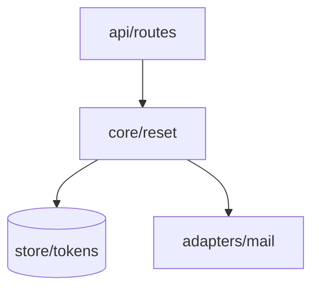

# The structure artifact — section contract

The shape of what `architecture-design` writes. `SKILL.md` carries the method; this carries the format.

**The six headings and their order are fixed.** The first five are Anthropic's `system-design` framework,
verbatim and in its order; the sixth is this suite's, because the two sweeps in `lens-passes.md` need
somewhere to land and a person needs their questions kept apart from the answers. `spec-review` finds a
section by name. Number them as below.

One file carries the shape: `docs/features/<slug>/architecture.md`, self-contained against its own
`research.md`. There is no repository-level map to inherit from; a decided layer order lives in `docs/adr/`,
cited by §2. `SKILL.md` step 2 sets the 2000-line budget that binds every section here — the sections are
tables and citations precisely so the budget is spent on rows.

## The header block

Open with a fenced block, before §1:

```
feature:  <slug>
status:   unsigned
reads:    acceptance.md · research.md · prd.md · environment.md · docs/adr/
```

Nothing an agent does flips `status:` — the signature is the whole point of the artifact.

## Two rules that bind every section

**Recap, never decide.** Every table has a provenance column — `Source`, `Decision`, or `ADR`. It carries a
§5 id, an `ADR-NNN` that resolves to a file, a named artifact (`prd.md`, `research.md`, `environment.md`),
or `default — not contested` where `spec-grilling` stated the answer as a batched default and the person let
it stand. A default they saw and did not object to is real provenance. An **empty** cell is not: it means
nobody has been asked, which is what the column exists to surface, and it becomes a §6 row rather than a
cell you fill in from judgement.

**Never pin what Plan owns.** No signature, field list, schema, wire format, or line number. §3 is where
this slips in, because its five topics are exactly the tempting ones: a row names the *decision* — "cursor
pagination, `ADR-014`" — and `api-design` writes the shape into `plan.md` later. Pin it here and you settle
during Spec what a person at the gate cannot check, while giving `plan-breakdown` two sources for one fact.

## The six sections

### `## 1. Requirements`

Three tables, in Anthropic's order. All recap — the second and third are usually the ones nobody wrote down,
which is why they get a table instead of a sentence.

**Functional requirements** — what it does.

| # | Requirement | Source |
|---|---|---|

One row per capability the feature owes, at product altitude: what the system does for whom, never how. The
per-scenario trace lives in §2, and repeating `acceptance.md`'s scenario list here gives the set-equality
check a second thing to disagree with.

**Non-functional requirements** — scale, latency, availability, cost.

| Dimension | Target | Source |
|---|---|---|

**All four dimensions get a row, every time**, in that order — an omitted dimension and one nobody thought
about look identical in a table of three, and the second is the one that ends a launch. Where no target was
stated, write `not stated` and raise a §6 row. Do not estimate one into the cell: a latency target is a
promise to a user and a cost ceiling a promise to whoever pays.

**Constraints** — what boxes the design in.

| Constraint | Value | Source |
|---|---|---|

Team size, timeline, and the existing stack at minimum — stack rows from `research.md` and
`environment.md`, the first two from the person, `not stated` where nobody said. These belong here because
they are the reasons a reader will otherwise read as incompetence: "why not just use a queue" is answered
by a row saying one engineer, three weeks.

### `## 2. High-level design`

Four parts, in Anthropic's order.

**Component diagram.** Draw the graph before you tabulate it — nobody can see a graph in a table; they have
to hold every row in their head and assemble it. Open with a Mermaid `flowchart` whose nodes are the
components below and whose arrows are exactly the edge rows: one arrow per row, no arrow without a row.



Mermaid because it is text: it splices into the page's source block without breaking the byte comparison,
renders in GitHub with nothing installed, and carries no asset the repository must keep.

| Component | Responsibility — its one reason to change | New | Depends on |
|---|---|---|---|

One row per unit with a single reason to change. `New` is a column because "which parts are new" is the
first thing the person at the gate has to answer, and a column answers it without reading.

| From | To | Why this edge exists | Decision |
|---|---|---|---|

Where a layer order was decided, state it above this table, say which edges it permits, put each layer in
its own Mermaid `subgraph` in that order — so an edge crossing the wrong way shows as an arrow pointing back
up rather than a row somebody has to notice — and cite the ADR per row. Where it was not, see
[Where no layer order is decided](#where-no-layer-order-is-decided).

Then two short lists, because a table of what exists cannot show either:

- **`Not components.`** — what a reader would expect in the table and why it is absent. A reader cannot
  derive an omission from a list.
- **`Edges a reader might expect and that do not exist:`** — each with its reason. "The rules never read the
  memory" is exactly the constraint a later diff breaks by accident.

**Data flow.** One row per **scenario in `acceptance.md`, keyed by its id**.

| Scenario | Behaviour | Path |
|---|---|---|

`Path` names the components in the order they act, joined with `→`. This is what makes the document
checkable rather than merely plausible: a scenario with no path is a behaviour nothing was designed to
handle.

**Set equality is the check:** every id appears exactly once, and every row names a scenario. Take the ids
out of both files and compare the sets — a read-through misses the one in the middle.

The two files are signed together, so a finding can point either way while both are still editable, at a
missing part of the structure *or* a scenario that should never have been written. Bound it at **one**
hand-back to `acceptance-criteria`; whatever survives is a §6 row.

**API contracts.** Who reaches this feature's surface, and what they may depend on.

| Consumer | Surface it reaches | What it may depend on | Decision |
|---|---|---|---|

Name a consumer **inside** the repository alongside the edge row that carries it, and one **outside** it — a
web client, another service, anyone holding a token — with no edge row, because none can carry one. The
outside ones are why this table exists: inside consumers are already visible in the diagram, outside ones
are visible nowhere else. `_none_` where nothing reaches in.

`What it may depend on` names the commitment at the level a person can check — resource model, one error
envelope, pagination stance, versioning and compatibility stance — and cites the record. Never the field
list. This is where Hyrum's Law does its damage: the surface commits to whatever a consumer can observe
whether or not this table says so.

**Storage choices.**

| Store | What it holds | Why this store | Decision |
|---|---|---|---|

`Why this store` gives the reason, not the choice restated: "one writer, so a queue buys nothing" is a
reason; "chose Postgres" is the `Store` cell said twice. A reader who cannot see why cannot tell a decision
from a default nobody examined.

### `## 3. Deep dive`

Five topics, in Anthropic's order, **each a recap of what was already decided** — the section the never-pin
rule above is aimed at.

Every topic gets its block even where the feature has nothing of that kind: the heading with
`_n/a — <one clause saying why>_` under it, e.g. "no cache; single-digit reads per minute". A topic absent
because it does not apply and one absent because nobody thought about it look identical otherwise, and only
the second is a problem.

| # | Decision | Why | Decision source |
|---|---|---|---|

Under each of:

- **Data model** — the entities and the relations between them, named. Not columns, not types.
- **API endpoint design** — the style (REST, GraphQL, gRPC) and the resources exposed. Not routes, not
  payloads.
- **Caching strategy** — what is cached, where, and what invalidates it.
- **Queue / event design** — what is asynchronous, and what ordering or delivery guarantee it rests on.
- **Error handling and retry logic** — what is retried, with what backoff, and **what is not retried and
  why**. That half is the one that matters: a non-idempotent write that gets retried is a corruption bug,
  and this row is where somebody notices before it is code.

A topic with no record behind it is a **§6 row**, not a cell you decide. Left out, it gets settled during
Implement by whichever slice reaches it first, and the person never sees the choice.

### `## 4. Scale and reliability`

Four parts, in Anthropic's order. **You may do the arithmetic; you may not pick the posture.** Estimating is
a calculation — the inputs are in §1 and the multiplication is checkable by anyone reading it. Choosing to
scale horizontally, add a replica, or accept an hour of downtime has a cost attached and goes through
`spec-grilling` into a record, or becomes a §6 row.

**Load estimation.** Show the arithmetic; a bare conclusion is not checkable.

| Quantity | Estimate | How it was derived |
|---|---|---|

`How it was derived` carries the inputs and the multiplication, each input cited to its §1 row —
`50k users × 2 resets/yr ÷ 3.2e7 s ≈ 0.003 rps`. A reader has to be able to disagree with the input, because
the input is what will turn out to be wrong.

**Horizontal vs. vertical scaling.**

| What scales | Direction | Bound it hits first | Decision |
|---|---|---|---|

`Bound it hits first` is the useful column and it is an observation: connections, memory, a single writer, a
rate limit. `Direction` is cited or `not decided`.

**Failover and redundancy.**

| Component | What happens when it fails | Recovery | Decision |
|---|---|---|---|

`What happens when it fails` is an observation of the system as designed, so write it even where nothing was
decided — including `request fails, no retry, user sees an error`. That row is the one a reader most needs;
deleting it to make the column look tidy removes the only warning there was.

**Monitoring and alerting.**

| Signal | What it would catch | Emitted today by | Alerts | Decision |
|---|---|---|---|---|

`Emitted today by` says **`nothing`** where nothing does, and the row stays. Naming a hypothetical dashboard
is what makes this section decorative; naming the gap is what makes it worth signing.
`observability-and-instrumentation` owns how a signal gets emitted — this table only records which ones the
design assumes exist.

### `## 5. Trade-offs`

Anthropic's rule is the whole section: every decision has trade-offs, so make them explicit. This is the
citation index §2, §3 and §4 point at, and where the cost of each choice is written down rather than implied.

| # | Chosen | Rejected | Cost paid | Why | ADR |
|---|---|---|---|---|---|

`Rejected` and `Why` are copied from the record. A record with nothing rejected is a §6 question — a choice
with no alternative was not a choice.

`Cost paid` is the column this framework is built around and the one an agent skips: name what got worse,
along whichever of complexity, cost, team familiarity, time to market, or maintainability this decision
spent. "Nothing" is not available; if you cannot name the cost, the trade-off was not analysed, and that is
a §6 row.

`ADR` points at the record where the decision was hard to reverse. A choice too cheap to reverse for a
record still gets a row with `ADR` empty — it was chosen, and nothing else records that. For those rows
`Why` is written here or nowhere, and it gives the **reason**, never the choice restated.

**What we would revisit as the system grows.** Anthropic's framework closes on this, and it is what a design
document is uniquely able to carry: the author knows which assumptions are load-bearing, and six months
later nobody does.

| Trigger | What breaks | What we would change |
|---|---|---|

`Trigger` is an observable threshold, not a feeling — `> 50 rps`, `a second writer`, `a mobile client`,
`retention past 90 days`. Each names an assumption in §1 or §4 that stops holding, so a later reader can
check whether it still does. "If it gets slow" is worth nothing to them.

### `## 6. Open questions for the human`

Numbered, under two headings:

```
### Left open by spec-grilling
### Raised by the depth and interface passes
```

**Open the section with this line, in these words:**

> These are unanswered by design. The person answers them at the gate; no agent resolves one.

Every row carries a recommended answer, which makes it read exactly like something a later pass should
apply — `spec-review`'s standing instruction on a contestable item is to apply its best correction and flag
it inline. That line is what stops it.

Each row states the question, then a **recommended** answer with one sentence of reasoning, answerable at
the gate without opening a skill. The two groups stay separate because their provenance differs: the first
is what the dialogue could not settle, the second is what a code-cold sweep found in what got written.

**Only what `spec-grilling` could not settle belongs in the first group** — a question the dialogue left
open, a scenario that came back unresolved from §2, a `not stated` cell in §1, a §3 topic no record answers,
a `Cost paid` nobody can name. A question you could have cited a record for is not open, and one you never
put to the person is not open either.

**The second heading is written even when nothing came back**, with `_none_` under it. Two sweeps that found
nothing and two that never ran leave the same blank section otherwise, and those have different fixes.

## Where no layer order is decided

Most repositories the suite installs into have never decided one. §2 then has one job: **record what the
code does today, and say that nothing has been decided.**

- Write `layer order: not decided` above the edge table, in those words, so the phrase is greppable.
- Fill the table from `research.md` only. `Why this edge exists` says where it was found, not why it ought to
  be there.
- **Propose nothing.** No "should", no target state, no `subgraph` tiers, no row ordering that implies one.
  Numbering components into tiers decides the order without saying so.
- If the feature cannot proceed without an answer, that is a §6 question.

A reader has to be able to tell **what the code does** from **what a diff is permitted to do**. Where no
order is decided the second is empty, and §2 says so rather than leaving the first to be read as both. A
document that quietly invents a layering is worse than none: the next feature inherits an order nobody chose
and nobody can point at who chose it.

**A later feature reads those rows as observations, not permission.** It records its own edges from its own
`research.md`; it does not read the recorded set as the set it may add to, nor an absent edge as forbidden —
neither reading is available from an observation. Deciding the order is its own decision, through
`spec-grilling` into `docs/adr/`, signed by a person. Until someone does, every feature's §2 carries the
same line.

## The page

`docs/features/<slug>/architecture.html`, hand-authored, committed next to the markdown, read by the person
at the gate. The markdown stays: a later feature's structure is a delta against this one, and a delta needs
a base something can diff.

**Self-contained, no external requests.** Inline the CSS and any script, embed images as `data:` URIs, use
system font stacks. One remote font makes the artifact depend on a host nobody in the repository controls,
and a colleague opening it months later with the network off must see the same page.

**Theme-aware.** Define the light palette on bare `:root`, redefine the same tokens under
`@media (prefers-color-scheme: dark)` guarded as `:root:not([data-theme="light"])`, and again under
`:root[data-theme="dark"]`. Give `body` an explicit background token.

**It draws §2's diagram, not just the table.** The source block carries the Mermaid text, but text is not a
picture and the page exists so a person can see the structure. Draw the same nodes and arrows as **inline
SVG** — inline because the page takes no external requests and a Mermaid runtime would be one. Where the
drawing and the block disagree, the drawing is what changes.

**It embeds `architecture.md` verbatim**, in a collapsed source block:

```html
<details>
  <summary>Source — <code>architecture.md</code>, embedded verbatim</summary>
  <div><pre id="src-out"></pre></div>
</details>

<script id="src-md" type="text/markdown">…the file's bytes…</script>
<script>
  document.getElementById('src-out').textContent =
    document.getElementById('src-md').textContent.replace(/^\n/, '');
</script>
```

**Splice the block from the file. Do not retype it.** The opening tag is immediately followed by the file's
first byte, the closing tag immediately follows its last. Do not reflow, re-wrap a long line, or fix a typo
on the way through — fix it in `architecture.md` and splice again. Retyping is the whole reason the block
exists: two hand-authored copies of one fact drift, and a typed one drifts on its first character while
looking exactly like one that did not.

One constraint this puts on the markdown: `architecture.md` must not contain the literal string
`</script>`, which would end the block early and make the comparison report drift that is not drift. If a
code fence needs it, split the token.

## The comparison check

The page cannot silently disagree with its source, and the way that is known is a **comparison, not an
inspection** — reading a page and its markdown side by side is how "38 skills" and "39 skills" both looked
right at the same byte count.

| Exit | Means | Fix |
|---|---|---|
| `0` | the block is byte-identical to the file | nothing |
| `1` | the block is present and drifted | re-splice from `architecture.md` |
| `2` | there is no block at all | the page is not conforming; add it |

```bash
python3 - docs/features/<slug>/architecture.md docs/features/<slug>/architecture.html <<'PY'
import pathlib, re, sys
md = pathlib.Path(sys.argv[1]).read_text()
html = pathlib.Path(sys.argv[2]).read_text()
m = re.search(r'<script id="src-md" type="text/markdown">(.*?)</script>', html, re.S)
if not m:
    print("FAIL: no embedded source block"); sys.exit(2)
if m.group(1) != md:
    print(f"FAIL: drift — embedded {len(m.group(1))} B vs file {len(md)} B"); sys.exit(1)
print("PASS: embedded block byte-identical"); sys.exit(0)
PY
```

Run it against a deliberately drifted copy once before you trust it. A check you have only ever watched pass
is not known to work, and this repository has shipped one that passed over the exact condition it existed to
prevent.
