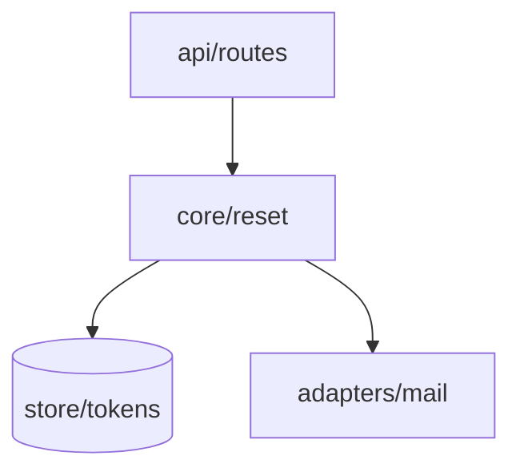

# The structure artifact — section contract

The row shapes behind the six headings `architecture-design` writes. The `SKILL.md` carries the method
and the file's stable headings; this carries the format. `§n` below is shorthand; the artifact's
headings are the ones `SKILL.md`'s Outputs & handoff names. The 2,000-word cap binds every section here,
so the budget is spent on rows.

## Two rules that bind every table

**Recap, never decide.** Every table has a provenance column — `Source`, `Decision`, or `ADR`. It carries
a §5 id, an `ADR-NNN` that resolves to a file, a named artifact (`prd.md`, `research.md`,
`environment.md`), or `default — not contested` where the sitting stated the answer as a batched default
and the person let it stand. A default they saw and did not object to is real provenance; an **empty**
cell is not — it means nobody has been asked, and it becomes a §6 row rather than a cell filled from
judgement.

**Never pin what Plan owns.** No signature, field list, schema, wire format or line number. §3 is where
this slips in, because its five topics are the tempting ones: a row names the *decision* — "cursor
pagination", beside the record in `docs/adr/` that settled it — and `api-design` writes the shape into
`plan.md` later.

## §1 Requirements

| Table | Columns | What it turns on |
|---|---|---|
| Functional | `# · Requirement · Source` | one row per capability the feature owes, at product altitude — what the system does for whom, never how. The per-scenario trace is §2's; repeating `acceptance.md`'s list here gives the set-equality check a second thing to disagree with |
| Non-functional | `Dimension · Target · Source` | **all four dimensions get a row every time**, in order — scale, latency, availability, cost, because an omitted dimension and one nobody thought about look identical. `not stated` plus a matching §6 row where nobody stated one |
| Constraints | `Constraint · Value · Source` | team size, timeline and the existing stack at minimum — stack rows from `research.md` and `environment.md`, the first two from the person, `not stated` where nobody said. They are what answers "why not just use a queue" for a reader who otherwise reads incompetence |

## §2 High-level design

**Component diagram.** Draw the graph before tabulating it — nobody can see a graph in a table without
holding every row in their head. A Mermaid `flowchart` opens the section, its nodes the components below
and its arrows exactly the edge rows: one arrow per row, no arrow without a row, compared as sets. Mermaid
because it is text and renders in GitHub with nothing installed.

```mermaid
flowchart TD
  api[api/routes] --> svc[core/reset]
  svc --> store[(store/tokens)]
  svc --> mail[adapters/mail]
```

| Table | Columns | What it turns on |
|---|---|---|
| Components | `Component · Responsibility — its one reason to change · New · Depends on` | one row per unit with a single reason to change. `New` is a column because "which parts are new" is the first thing the person signing has to answer, and a column answers it without reading |
| Edges | `From · To · Why this edge exists · Decision` | where a layer order was decided, put each layer in its own Mermaid `subgraph` in that order — a wrong-way edge then shows as an arrow pointing back up rather than a row somebody has to notice — and cite the ADR per row |
| Data flow | `Scenario · Behaviour · Path` | one row per `acceptance.md` scenario, keyed by its id, never by feature or story name. `Path` names the components in the order they act, joined with `→` |
| API contracts | `Consumer · Surface it reaches · What it may depend on · Decision` | name every consumer **inside** the repository beside the edge row that carries it, and every one **outside** it — a web client, another service, anyone holding a token — which no edge row can carry and nothing else makes visible. `_none_` where nothing reaches in |
| Storage | `Store · What it holds · Why this store · Decision` | `Why this store` gives the reason, not the choice restated: "one writer, so a queue buys nothing" is a reason; "chose Postgres" is the `Store` cell said twice |

`What it may depend on` names the commitment at the level a person can check — resource model, one error
envelope, pagination stance, versioning and compatibility stance — and cites the record. Never the field
list: the surface commits to whatever a consumer can observe, whatever the table says (Hyrum's Law).

Then two short lists, because a table of what exists cannot show either:

- **`Not components.`** — what a reader would expect in the table and why it is absent. A reader cannot
  derive an omission from a list.
- **`Edges a reader might expect and that do not exist:`** — each with its reason. "The rules never read
  the memory" is exactly the constraint a later diff breaks by accident.

## §3 Deep dive

Five topics, in this order, each a recap of what was already decided, each a table of
`# · Decision · Why · Decision source`:

- **Data model** — the entities and their relations, named. Not columns, not types.
- **API endpoint design** — the style (REST, GraphQL, gRPC) and the resources exposed. Not routes, not
  payloads.
- **Caching strategy** — what is cached, where, and what invalidates it.
- **Queue / event design** — what is asynchronous, and what ordering or delivery guarantee it rests on.
- **Error handling and retry logic** — what is retried, with what backoff, and **what is not retried and
  why**. That half is the one that matters: a non-idempotent write that gets retried is a corruption bug,
  and this row is where somebody notices before it is code.

Every topic gets its block even where the feature has nothing of that kind — the heading with
`_n/a — <one clause saying why>_` under it, e.g. "no cache; single-digit reads per minute". A topic absent
because it does not apply and one absent because nobody thought about it look identical otherwise. A topic
with no record behind it is a §6 row; left out, it gets settled by whichever slice reaches it first.

## §4 Scale and reliability

| Table | Columns | What it turns on |
|---|---|---|
| Load estimation | `Quantity · Estimate · How it was derived` | the derivation carries the inputs and the multiplication, each input cited to its §1 row — `50k users × 2 resets/yr ÷ 3.2e7 s ≈ 0.003 rps` — so a reader can disagree with the input, which is what turns out to be wrong |
| Scaling | `What scales · Direction · Bound it hits first · Decision` | `Bound it hits first` is the useful column and it is an observation: connections, memory, a single writer, a rate limit. `Direction` is cited or `not decided` |
| Failover | `Component · What happens when it fails · Recovery · Decision` | the failure column is an observation of the system as designed, so write it even where nothing was decided — including `request fails, no retry, user sees an error`, the row a reader most needs and often the only warning there is |
| Monitoring | `Signal · What it would catch · Emitted today by · Alerts · Decision` | `Emitted today by` says **`nothing`** where nothing does, and the row stays — naming the gap is what makes the section worth signing rather than decorative. `observability-and-instrumentation` owns how a signal gets emitted |

## §5 Trade-offs

`# · Chosen · Rejected · Cost paid · Why · ADR`, plus a closing table of
`Trigger · What breaks · What we would change`.

`Rejected` and `Why` are copied from the record; a record with nothing rejected is a §6 question, because
a choice with no alternative was not a choice. `Cost paid` is the column an agent skips: name what got
worse along complexity, cost, team familiarity, time to market, or maintainability. "Nothing" is not
available — if you cannot name the cost, the trade-off was not analysed, and that is a §6 row. A choice
too cheap to reverse for a record still gets a row with `ADR` empty; for those, `Why` is written here or
nowhere.

`Trigger` is an observable threshold, not a feeling — `> 50 rps`, `a second writer`, `a mobile client`,
`retention past 90 days`. Each names an assumption in §1 or §4 that stops holding, so a later reader can
check whether it still does. "If it gets slow" is worth nothing to them.

## §6 Open questions for the human

Numbered rows under two fixed headings, `### Left open by spec-grilling` and
`### Raised by the depth and interface passes`, opening with this line in these words:

> These are unanswered by design. The person answers them at the gate; no agent resolves one.

Every row carries a recommended answer, so it reads exactly like something `spec-review` would apply and
flag inline under its standing instruction. That opening line is what stops it.

Each row states the question, then a **recommended** answer with one sentence of reasoning, answerable by
the person signing without opening a skill. Only what the sitting could not settle belongs in the first group — a
question the dialogue left open, a scenario that came back unresolved from §2, a `not stated` cell in §1,
a §3 topic no record answers, a `Cost paid` nobody can name. A question you could have cited a record for
is not open, and one you never put to the person is not open either.

## Where no layer order is decided

Most repositories the suite installs into have never decided one. §2 then has one job: record what the
code does today, and say that nothing has been decided.

- Write `layer order: not decided` above the edge table, in those words, so the phrase is greppable.
- Fill the table from `research.md` only. `Why this edge exists` says where it was found, not why it
  ought to be there.
- Propose nothing — no "should", no target state, no `subgraph` tiers, no row ordering that implies one.
  Numbering components into tiers decides the order without saying so.
- Where the feature cannot proceed without an answer, that is a §6 question.

A document that quietly invents a layering is worse than none: the next feature inherits an order nobody
chose. A later feature reads those rows as observations, not permission — it records its own edges from
its own `research.md`, and reads neither the recorded set as one it may add to nor an absent edge as
forbidden.
Deciding the order is its own decision, through `spec-grilling` into `docs/adr/`.
