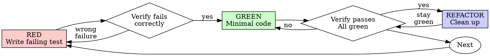

# Test-Driven Development (TDD)

## Purpose

**Stage: Implement — the rigid core loop, applied inside every `incremental-implementation` slice.**

Write the test first. Watch it fail. Write minimal code to pass.

**Core principle:** if you didn't watch the test fail, you don't know if it tests the right thing.

This is the suite's one non-negotiable loop. Everything upstream (intent → prd → `acceptance.md`)
converges here: each signed Given/When/Then scenario becomes a *failing* test before a line of
production code exists, realized by judgment in the project's real test framework — there is **no
Cucumber/step-def engine**. In the autonomous run no human watches you code, so the only
proof a test tests something real is that you saw it go RED first.

**Violating the letter of the rules is violating the spirit of the rules.**

## When to use / when to skip

**Always — structurally applied during every `incremental-implementation` slice:**
- New features
- Bug fixes
- Refactoring
- Behavior changes

**Exceptions (the only ones — they mirror the test-first commit hook's allowlist):**
- Throwaway prototypes (e.g. `frontend-design` exploration it discards)
- Generated code
- Configuration files

Thinking "skip TDD just this once"? Stop. That's rationalization. Test-first ordering is
**hook-enforced**: a test file must change in the same commit as impl, or earlier on the branch.
`--no-verify` and SKIP-style bypasses are forbidden — fix the order, don't dodge the hook.

## Inputs

**Consumes:** `acceptance.md` — the signed BDD prose contract (from the `acceptance-criteria` skill). Sections
this skill reads:
- **Given/When/Then scenarios** — behavioral-only (happy + error/edge + security-observable). Each
  becomes one test.
- **Feature-namespaced scenario ids** (e.g. `PWR-A1`) — carry the id in each test's name/description so
  `quality-verification` can keep its exercised / not-reachable ledger by id.
- **`status:`** — must be `signed`.

Also handed in by `incremental-implementation` / the `orchestrator`: the slice's **plan steps** (which files, which
tests) and the slice's declared **`Regression surface`**.

**Refuse to run if:**
- `acceptance.md` is **absent**, or
- `acceptance.md` `status:` is `draft` (unsigned, or re-invalidated by a later `prd.md` edit).

A draft/absent contract means the human-signed oracle isn't fixed — implementing against it bakes in an
unsigned target. Stop and route back to the Spec gate.

## Process

Each signed scenario in `acceptance.md` becomes a failing test **first**; you write the minimal code to
turn it green; you refactor under green. You translate Given/When/Then into a real test **by judgment**,
not via a code generator. Name each test for its scenario id (`PWR-A1`) so the realization is traceable.

### Red-Green-Refactor



### The Iron Law

```
NO PRODUCTION CODE WITHOUT A FAILING TEST FIRST
```

Write code before the test? Delete it. Start over.

**No exceptions:**
- Don't keep it as "reference"
- Don't "adapt" it while writing tests
- Don't look at it
- Delete means delete

Implement fresh from tests. Period.

### RED - Write Failing Test

Write one minimal test showing what should happen.

<Good>
```typescript
test('PWR-A3: retries failed operations 3 times', async () => {
  let attempts = 0;
  const operation = () => {
    attempts++;
    if (attempts < 3) throw new Error('fail');
    return 'success';
  };

  const result = await retryOperation(operation);

  expect(result).toBe('success');
  expect(attempts).toBe(3);
});
```
Clear name carrying the scenario id, tests real behavior, one thing
</Good>

<Bad>
```typescript
test('retry works', async () => {
  const mock = jest.fn()
    .mockRejectedValueOnce(new Error())
    .mockRejectedValueOnce(new Error())
    .mockResolvedValueOnce('success');
  await retryOperation(mock);
  expect(mock).toHaveBeenCalledTimes(3);
});
```
Vague name, no scenario id, tests mock not code
</Bad>

**Requirements:**
- One behavior
- Clear name (carry the `acceptance.md` scenario id)
- Real code (no mocks unless unavoidable)

### Verify RED - Watch It Fail

**MANDATORY. Never skip.**

```bash
npm test path/to/test.test.ts
```

Confirm:
- Test fails (not errors)
- Failure message is expected
- Fails because feature missing (not typos)

**Test passes?** You're testing existing behavior. Fix test.

**Test errors?** Fix error, re-run until it fails correctly.

### GREEN - Minimal Code

Write simplest code to pass the test.

<Good>
```typescript
async function retryOperation<T>(fn: () => Promise<T>): Promise<T> {
  for (let i = 0; i < 3; i++) {
    try {
      return await fn();
    } catch (e) {
      if (i === 2) throw e;
    }
  }
  throw new Error('unreachable');
}
```
Just enough to pass
</Good>

<Bad>
```typescript
async function retryOperation<T>(
  fn: () => Promise<T>,
  options?: {
    maxRetries?: number;
    backoff?: 'linear' | 'exponential';
    onRetry?: (attempt: number) => void;
  }
): Promise<T> {
  // YAGNI
}
```
Over-engineered
</Bad>

Don't add features, refactor other code, or "improve" beyond the test.

### Verify GREEN - Watch It Pass

**MANDATORY.**

```bash
npm test path/to/test.test.ts
```

Confirm:
- Test passes
- Other tests still pass
- Output pristine (no errors, warnings)

**Test fails?** Fix code, not test.

**Other tests fail?** Fix now.

### REFACTOR - Clean Up

After green only:
- Remove duplication
- Improve names
- Extract helpers

Keep tests green. Don't add behavior.

### Repeat

Next failing test for the next scenario / feature.

### Good Tests

| Quality | Good | Bad |
|---------|------|-----|
| **Minimal** | One thing. "and" in name? Split it. | `test('validates email and domain and whitespace')` |
| **Clear** | Name describes behavior + scenario id | `test('test1')` |
| **Shows intent** | Demonstrates desired API | Obscures what code should do |

## Frozen artifacts under retry (gate-erosion is a HALT)

In the autonomous run no human watches you grade your own work, so the RED tests are a human-anchored
oracle that must not drift. Three things are **immutable while a slice is in its retry loop**:
- the consumed **`acceptance.md`** scenarios,
- the **RED tests** you wrote for them,
- the slice's declared **`Regression surface`**.

A retry diff that **weakens an assertion, deletes/skips a RED test, narrows the surface, or edits a
scenario** is **gate-erosion → HALT** the slice (flip `gate: agent → you`). Do not "fix" the test to
make it pass.

If the failure signature only moved because a test/acceptance was edited while the implementation is
materially unchanged, that is the **reward-hack tripwire → HALT**.

**Fix the code, never the oracle.** A frozen failing test is information; a relaxed test is a silent
false-green.

## Rationalizations

**"I'll write tests after to verify it works"** — Tests written after code pass immediately, which
proves nothing: might test the wrong thing, might test implementation not behavior, might miss edge
cases, you never saw it catch the bug. Test-first forces you to see it fail.

**"I already manually tested all the edge cases"** — Manual testing is ad-hoc: no record, can't re-run,
easy to forget under pressure. "It worked when I tried it" ≠ comprehensive.

**"Deleting X hours of work is wasteful"** — Sunk cost. The time is gone. Keeping code you can't trust
is technical debt.

**"TDD is dogmatic, being pragmatic means adapting"** — TDD IS pragmatic: finds bugs before commit,
prevents regressions, documents behavior, enables refactoring. "Pragmatic" shortcuts = debugging in
production = slower.

**"Tests after achieve the same goals — it's spirit not ritual"** — No. Tests-after answer "what does
this do?"; tests-first answer "what should this do?" Tests-after are biased by your implementation.

| Excuse | Reality |
|--------|---------|
| "Too simple to test" | Simple code breaks. Test takes 30 seconds. |
| "I'll test after" | Tests passing immediately prove nothing. |
| "Tests after achieve same goals" | Tests-after = "what does this do?" Tests-first = "what should this do?" |
| "Already manually tested" | Ad-hoc ≠ systematic. No record, can't re-run. |
| "Deleting X hours is wasteful" | Sunk cost fallacy. Keeping unverified code is technical debt. |
| "Keep as reference, write tests first" | You'll adapt it. That's testing after. Delete means delete. |
| "Need to explore first" | Fine. Throw away exploration, start with TDD. |
| "Test hard = design unclear" | Listen to the test. Hard to test = hard to use. |
| "TDD will slow me down" | TDD faster than debugging. Pragmatic = test-first. |
| "Existing code has no tests" | You're improving it. Add tests for existing code. |
| "Just relax the assertion so the slice ships" | **Gate-erosion HALT.** The RED test is frozen. Fix the code or halt the slice. |

## Red flags

STOP and start over (or HALT the slice) on any of these:

- Code before test
- Test after implementation
- Test passes immediately
- Can't explain why test failed
- Tests added "later"
- Rationalizing "just this once"
- "I already manually tested it"
- "Tests after achieve the same purpose"
- "It's about spirit not ritual"
- "Keep as reference" or "adapt existing code"
- "Already spent X hours, deleting is wasteful"
- "TDD is dogmatic, I'm being pragmatic"
- "This is different because..."

Gate-erosion red flags (HALT the slice, flip `gate: agent → you`):
- Weakening/deleting/skipping a frozen RED test to make a slice pass
- Editing an `acceptance.md` scenario mid-retry
- Narrowing the declared `Regression surface` to dodge a failure

**The first group means: delete code, start over with TDD. The second group means: stop, do not ship.**

## Verification (ending criteria)

This is where BDD binds: **every signed `acceptance.md` scenario reachable in this slice has a test that
failed first and now passes, and each test names its scenario id.**

Before marking the slice's implementation complete:

- [ ] Every reachable `acceptance.md` scenario has a test (named with its id)
- [ ] Every new function/method has a test
- [ ] Watched each test fail before implementing
- [ ] Each test failed for the expected reason (feature missing, not typo)
- [ ] Wrote minimal code to pass each test
- [ ] All tests pass
- [ ] Output pristine (no errors, warnings)
- [ ] Tests use real code (mocks only if unavoidable)
- [ ] Edge cases and errors covered
- [ ] No frozen test/acceptance/surface was weakened during retries

Can't check all boxes? You skipped TDD. Start over.

### Example: Bug Fix

**Bug:** Empty email accepted.

**RED**
```typescript
test('PWR-A2: rejects empty email', async () => {
  const result = await submitForm({ email: '' });
  expect(result.error).toBe('Email required');
});
```

**Verify RED**
```bash
$ npm test
FAIL: expected 'Email required', got undefined
```

**GREEN**
```typescript
function submitForm(data: FormData) {
  if (!data.email?.trim()) {
    return { error: 'Email required' };
  }
  // ...
}
```

**Verify GREEN**
```bash
$ npm test
PASS
```

**REFACTOR** — extract validation for multiple fields if needed.

### When Stuck

| Problem | Solution |
|---------|----------|
| Don't know how to test | Write the wished-for API. Write the assertion first. |
| Test too complicated | Design too complicated. Simplify the interface. |
| Must mock everything | Code too coupled. Use dependency injection. |
| Test setup huge | Extract helpers. Still complex? Simplify design. |

### Debugging Integration

Bug found? Write a failing test reproducing it, then follow the TDD cycle. The test proves the fix and
prevents regression. **Never fix bugs without a test** — this also feeds `debugging-and-error-recovery`:
the reproducer test is the "guard" step.

### Final Rule

```
Production code → test exists and failed first
Otherwise → not TDD
```

## Outputs & handoff contract

**Emits:** `tests + code` into the slice's worktree diff —
- passing tests, one per realized `acceptance.md` scenario (named with the scenario id), each watched
  RED before its production code existed;
- the minimal production code that turns them green;
- output pristine (no errors/warnings); all prior tests still green.

**Stable handoff facts (what downstream consumes):**
- Each test carries its **scenario id** (`PWR-A1`) → `quality-verification` reads these to build its exercised /
  not-reachable ledger in `qa.md`; the evaluator's `testing_strategy` floor and the `pull-request` code-cold
  verifier rely on the RED tests being **unweakened**.
- The RED tests + `acceptance.md` + `Regression surface` are now the slice's **frozen oracle** (see
  *Frozen artifacts under retry*).
- A scenario **not reachable** in this slice is **not silently skipped** — record its id so `qa.md` and
  the PR body carry the required not-reachable ack.

**STATE.md:** `test-driven-development` does not drive the board itself (the `orchestrator` owns `STATE.md`). It runs while
the slice is `impl`; on green-and-pristine the slice is ready for `incremental-implementation` to complete and hand to
`quality-verification` (`verify`).

## Testing Anti-Patterns

When adding mocks or test utilities, read
[references/testing-anti-patterns.md](references/testing-anti-patterns.md) to avoid common pitfalls
(AP1–AP5):
- Testing mock behavior instead of real behavior
- Adding test-only methods to production classes
- Mocking without understanding dependencies
- Incomplete mocks (mirror the real structure)
- Integration tests as an afterthought

## Subagents

For a fresh-context, code-cold pass, dispatch the **`test-engineer`** agent (`agents/test-engineer.md`) as an
independent subagent. This skill is the *method*; the agent is the *role* that applies it with no prior
context — preserving maker≠checker. Reach for it when designing the test strategy, or auditing whether a
slice's tests are honest (not mock-shaped).
